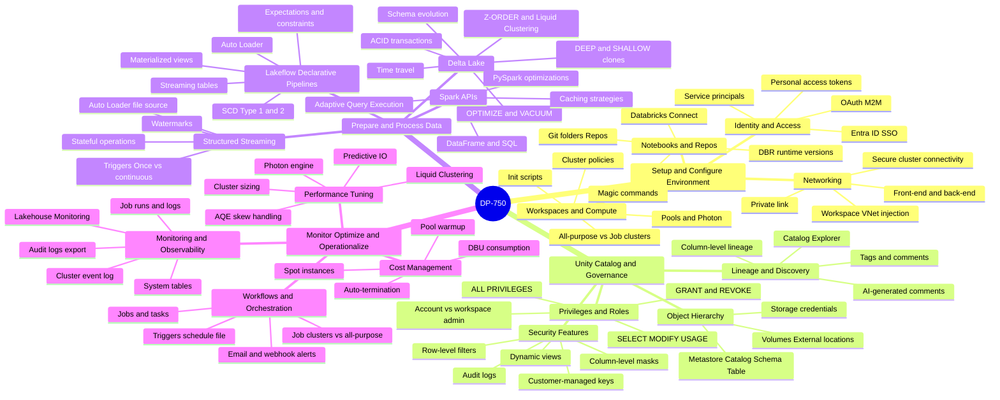
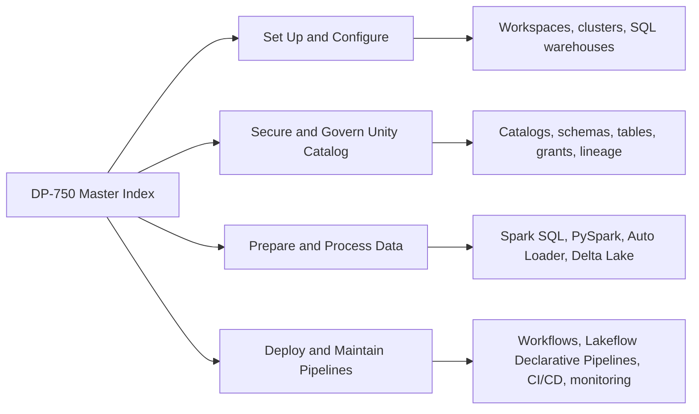
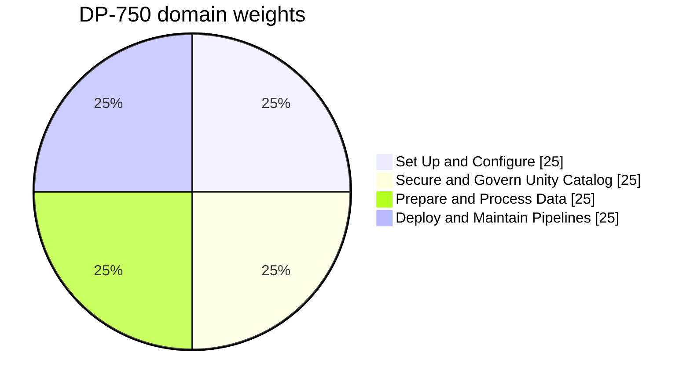

# DP-750 - Microsoft Certified: Azure Databricks Data Engineer Associate - Visual Study Guide

> Concept-only study aid. No exam questions reproduced. Source PDF (if any) stays local + gitignored.

**Skills outline:** https://learn.microsoft.com/credentials/certifications/exams/dp-750/

## Audience

DP-750 is for **data engineers using Azure Databricks** to build, deploy, and operate data pipelines on Delta Lake + Unity Catalog. It assumes practical experience with Spark SQL, PySpark, Databricks workflows, and Lakeflow Declarative Pipelines (formerly Delta Live Tables / DLT).

## The 4 Exam Domains - Mind Map

## Domain map

## Domain weights

## Recommended study order

```mermaid
gantt
    title Suggested study plan
    dateFormat X
    axisFormat Day %d
    section Plan
    Set Up and Configure :t1, 0, 2d
    Secure and Govern Unity Catalog :t2, after t1, 2d
    Prepare and Process Data :t3, after t2, 2d
    Deploy and Maintain Pipelines :t4, after t3, 2d
```

## Top 20 things to know

1. **Workspace** is the top-level Databricks container; **Unity Catalog** is the cross-workspace governance layer.
2. **Cluster types**: All-purpose (interactive), Job (ephemeral, cheaper), SQL warehouse (DBSQL).
3. **Compute access modes**: Single User (Assigned), Shared, No Isolation.
4. **Unity Catalog** uses 3-level namespace: `catalog.schema.table`.
5. **Delta Lake** is the default table format - ACID, time travel, schema enforcement / evolution.
6. **Auto Loader** (`cloudFiles`) ingests new files incrementally with schema inference.
7. **COPY INTO** is the SQL alternative for one-time / batch loads.
8. **Lakeflow Declarative Pipelines** (formerly Delta Live Tables / DLT) provide declarative ETL with expectations.
9. **Bronze / Silver / Gold** medallion architecture is the canonical Databricks pattern.
10. **OPTIMIZE** compacts small files; **OPTIMIZE ... ZORDER BY** clusters by columns; **VACUUM** removes old versions.
11. **Liquid clustering** replaces partitioning + ZORDER for new tables.
12. **Predictive Optimization** auto-runs OPTIMIZE / VACUUM.
13. **Workflows** (Jobs) orchestrate notebooks, Python scripts, dbt projects, SQL queries.
14. **Databricks Asset Bundles** package projects for CI/CD across environments.
15. **Lineage** is automatic in Unity Catalog (table + column-level for Delta).
16. **Row filters and column masks** enforce data security in Unity Catalog.
17. **Service principals** are the recommended automation identity; **Personal Access Tokens (PAT)** are deprecated for prod.
18. **Photon** is the vectorized engine - faster + costs more DBUs.
19. **Pools** speed up cluster startup with pre-warmed instances.
20. **Secrets** stored in Databricks Secret Scopes (or Azure Key Vault-backed scopes).

## Common gotchas

- Hive Metastore tables are NOT Unity Catalog - must migrate.
- Single-user clusters can run UDFs that shared clusters can't (yet).
- DLT/Lakeflow tables can only be edited by the pipeline.
- `MERGE` updates need a unique key - duplicates cause non-deterministic results.
- Default file format is Delta in Databricks Runtime 8.0+.

## Supporting pages

- [05-exam-cheatsheet.md](05-exam-cheatsheet.md)
- [06-references.md](06-references.md)
- [07-extra-dp750-concepts.md](07-extra-dp750-concepts.md)
- [08-learn-summaries.md](08-learn-summaries.md)
- [09-arch-dp750.md](09-arch-dp750.md)
- [11-microsoft-resources.md](11-microsoft-resources.md)
- [12-glossary.md](12-glossary.md)
- [13-flashcards.md](13-flashcards.md)
- [14-pitfalls.md](14-pitfalls.md)
- [15-hands-on-labs.md](15-hands-on-labs.md)
- [16-architecture-center.md](16-architecture-center.md)
- [17-copilot-quiz.md](17-copilot-quiz.md)
- [99-practice-assessment.md](99-practice-assessment.md)
- [99-video-tutorials.md](99-video-tutorials.md)

---

**Next:** open [01-setup-environment.md](01-setup-environment.md)
