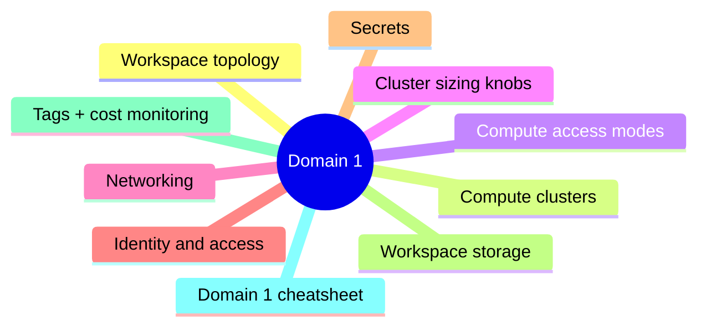
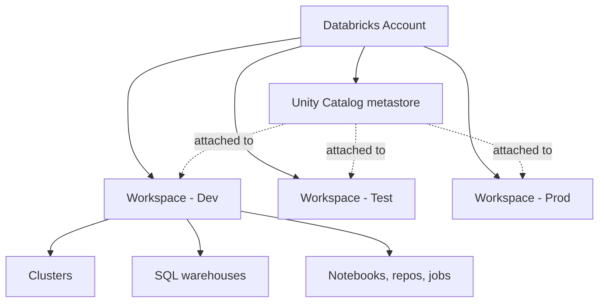
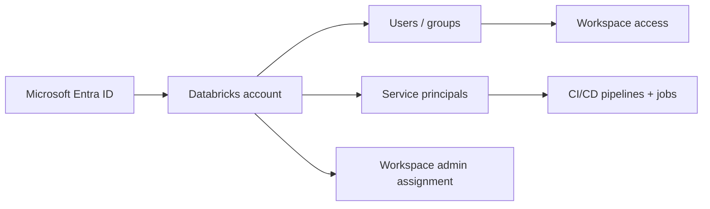

# Domain 1: Set Up and Configure an Azure Databricks Environment

> Workspaces, compute, networking, identity, secrets.


## Domain mind map



## Workspace topology



- One **Databricks account** per Microsoft Entra (Azure AD) tenant.
- **Unity Catalog metastore** lives at account level - one per region; multiple workspaces can attach.
- **Workspaces** are the Azure resource (Premium tier required for Unity Catalog).

## Compute (clusters)

| Type | Use | Notes |
|---|---|---|
| All-purpose / interactive | Notebooks, ad-hoc | Multi-user, longer-lived |
| Job cluster | Workflow tasks | Ephemeral, cheaper |
| SQL warehouse | Databricks SQL queries | Serverless preferred (fastest startup) |
| Pool | Pre-warmed instances | Speeds up cluster start |

## Compute access modes

| Mode | Single user | Languages | Unity Catalog |
|---|---|---|---|
| **Single User (Assigned)** | One user | All | y |
| **Shared** | Many users | Python, SQL, Scala (limited) | y |
| **No Isolation Shared** | Many users | All | n Not recommended |

## Cluster sizing knobs

- **Driver node** + **worker nodes**.
- **Autoscaling** - set min/max workers.
- **Photon** (toggle) - vectorized C++ engine; uses more DBUs but faster.
- **Spot instances** - cheaper but interruptible.
- **Cluster policies** - admins constrain what users can configure.

## Networking

| Pattern | Use |
|---|---|
| **Default (managed VNet)** | Quickest, less control |
| **VNet injection** | Connect to private resources, custom NSG, ExpressRoute |
| **Private Link** | Private endpoint for control plane / front-end |
| **No Public IP (NPI)** | Cluster nodes on private IPs only |

## Identity and access



- **SCIM provisioning** from Entra ID is the modern way to manage users + groups at account level.
- **Service principals** (Entra app or Databricks-managed) are the recommended automation identity.
- **PATs** are deprecated for production CI/CD.
- **OAuth** (machine-to-machine) recommended for CLI / SDK auth.

## Secrets

| Source | Notes |
|---|---|
| Databricks-backed secret scope | Stored in Databricks |
| **Azure Key Vault-backed secret scope** | Recommended - central secret management |

```python
dbutils.secrets.get(scope="kv-prod", key="storage-key")
```

## Workspace storage

- DBFS (Databricks File System) **root** - deprecated for new sensitive data.
- **External locations** (Unity Catalog) - preferred. ADLS Gen2 + storage credential + external location.

## Tags + cost monitoring

- Cluster tags for chargeback / cost allocation.
- **System tables** (`system.billing.usage`) provide consumption telemetry.

## Domain 1 cheatsheet

| Wording | Answer |
|---|---|
| "ephemeral cluster for a Workflow task" | Job cluster |
| "fastest cluster startup" | Serverless SQL warehouse / pool |
| "shared cluster + Unity Catalog + Scala UDF" | Single User mode (Shared has Scala restrictions) |
| "central secret store with rotation" | Azure Key Vault-backed secret scope |
| "automation identity for CI/CD" | Service principal (with OAuth) |
| "limit user cluster configs" | Cluster policy |
| "private network for clusters" | VNet injection / NPI / Private Link |

---

**Next:** open [02-unity-catalog.md](02-unity-catalog.md)
