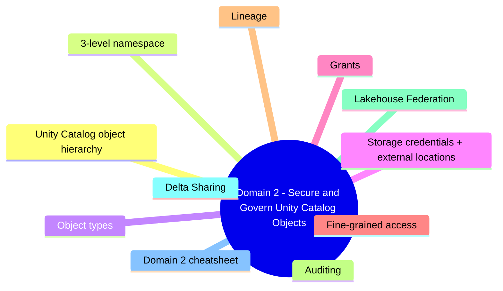
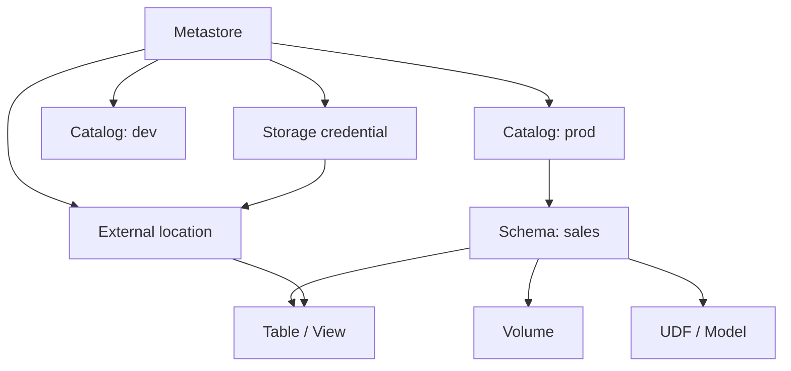
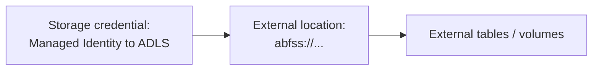

# Domain 2: Secure and Govern Unity Catalog Objects

> 3-level namespace, grants, fine-grained access, lineage.


## Domain mind map



## Unity Catalog object hierarchy



## 3-level namespace

```sql
SELECT * FROM prod.sales.orders;
-- catalog.schema.table
```

## Object types

| Object | Purpose |
|---|---|
| **Catalog** | Top-level container (env / domain) |
| **Schema (database)** | Group of tables / views / volumes |
| **Managed table** | Storage owned by Unity Catalog |
| **External table** | Storage at user-specified location |
| **View** | SQL view |
| **Volume** | Files (managed or external) - not tables |
| **Function** | User-defined function |
| **Model** | MLflow model |

## Storage credentials + external locations



- **Storage credential** wraps an Azure managed identity (or service principal) with permission to ADLS.
- **External location** = path + storage credential + permissions.
- Use external locations to reduce per-table credential sprawl.

## Grants

```sql
GRANT USE CATALOG ON CATALOG prod TO `data_engineers`;
GRANT USE SCHEMA ON SCHEMA prod.sales TO `data_engineers`;
GRANT SELECT ON TABLE prod.sales.orders TO `data_analysts`;
GRANT MODIFY ON TABLE prod.sales.orders TO `etl_sp`;
GRANT EXECUTE ON FUNCTION prod.sales.calc_tax TO `data_analysts`;
```

| Privilege | Scope |
|---|---|
| `USE CATALOG`, `USE SCHEMA` | Required to traverse |
| `SELECT`, `MODIFY` | Read / write tables |
| `CREATE` | Create new objects |
| `EXECUTE` | Functions |
| `READ VOLUME`, `WRITE VOLUME` | Volumes |
| `OWNERSHIP` | Full control |

## Fine-grained access

| Feature | What |
|---|---|
| **Row filters** | SQL function returning boolean; applied to table |
| **Column masks** | SQL function returning masked value (e.g. only last 4 of SSN) |
| **Dynamic views** | View using `current_user()` and `is_member()` |

```sql
CREATE FUNCTION mask_ssn(s STRING)
RETURN CASE WHEN is_member('hr_admins') THEN s ELSE 'XXX-XX-' || RIGHT(s, 4) END;

ALTER TABLE employees ALTER COLUMN ssn SET MASK mask_ssn;
```

## Lineage

- **Automatic** column- and table-level lineage on Delta tables in Unity Catalog.
- View in Catalog Explorer; query via `system.access.audit`.
- Lineage covers SQL queries + Lakeflow pipelines + workflows.

## Auditing

- All Unity Catalog operations recorded in `system.access.audit`.
- Combine with diagnostic logging for end-to-end forensics.

## Lakehouse Federation

- Read external data sources (PostgreSQL, MySQL, BigQuery, Snowflake, etc.) **as if they were Unity Catalog tables**.
- Pushdown query optimization where supported.

## Delta Sharing

- Open protocol for sharing data with external orgs (Databricks-to-Databricks or Databricks-to-anything).
- Provider creates a **Share**; recipients see it as a Unity Catalog catalog.

## Domain 2 cheatsheet

| Wording | Answer |
|---|---|
| "data isolation env-by-env" | Separate catalogs per env (dev / test / prod) |
| "central identity for ADLS access" | Storage credential (managed identity) + external location |
| "mask SSN for non-HR users" | Column mask function with `is_member` |
| "filter rows by user region" | Row filter function |
| "table-level audit + lineage" | Unity Catalog (system tables + Catalog Explorer) |
| "share dataset with another org" | Delta Sharing |
| "query Postgres as if it were a Databricks table" | Lakehouse Federation |
| "table where Databricks owns the storage" | Managed table |

---

**Next:** open [03-prepare-process.md](03-prepare-process.md)
