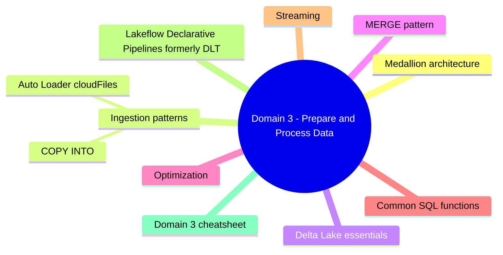
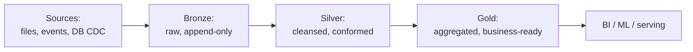
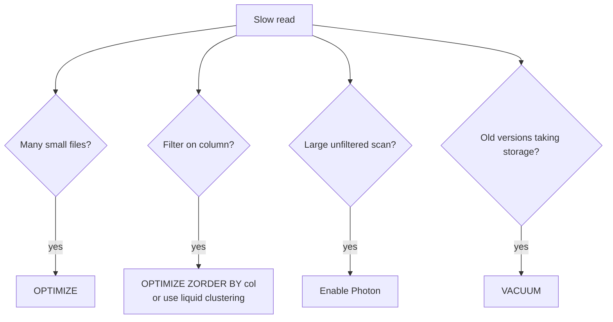

# Domain 3: Prepare and Process Data

> Spark SQL, PySpark, Delta Lake, Auto Loader, ingestion + transformation patterns.


## Domain mind map



## Medallion architecture



## Ingestion patterns

```mermaid
flowchart TB
    Files[Files in ADLS]
    Files --> AL[Auto Loader<br/>(cloudFiles)]
    Files --> CI[COPY INTO]
    Stream[Streaming source]
    Stream --> SS[Structured Streaming<br/>readStream]
    DB[OLTP DB]
    DB --> Fed[Lakehouse Federation<br/>(query in place)]
    DB --> CDC[CDC tool then Auto Loader]
```

### Auto Loader (`cloudFiles`)

```python
df = (spark.readStream.format("cloudFiles")
       .option("cloudFiles.format", "json")
       .option("cloudFiles.schemaLocation", "/Volumes/prod/sales/schemas/orders")
       .load("/Volumes/prod/sales/landing/orders"))
(df.writeStream.option("checkpointLocation", "/Volumes/prod/sales/checkpoints/orders")
       .trigger(availableNow=True)  # batch-style backfill
       .toTable("prod.sales.bronze_orders"))
```

- **Schema inference + evolution** (`addNewColumns`, `failOnNewColumns`, `none`, `rescue`).
- **Trigger options**: `processingTime`, `availableNow` (batch-style), `continuous`.
- Uses notification mode (event grid) or directory listing.

### COPY INTO

```sql
COPY INTO prod.sales.bronze_orders
FROM '/Volumes/prod/sales/landing/orders'
FILEFORMAT = JSON
COPY_OPTIONS ('mergeSchema' = 'true');
```

- One-shot load with idempotency (skips already-loaded files).
- Better for batch-style; Auto Loader is better for streaming + scale.

## Delta Lake essentials

| Feature | What |
|---|---|
| **ACID transactions** | All operations atomic |
| **Time travel** | `SELECT * FROM tbl VERSION AS OF 12` / `TIMESTAMP AS OF '2024-01-01'` |
| **Schema enforcement** | Reject mismatched writes |
| **Schema evolution** | `mergeSchema=true` to allow added columns |
| **MERGE** | Upsert + delete in one statement |
| **OPTIMIZE / ZORDER** | Compact + cluster |
| **VACUUM** | Remove tombstoned files (default 7-day retention) |
| **Liquid clustering** | New default clustering - replaces partitioning |
| **Deletion vectors** | Soft-delete rows for faster updates |
| **Change Data Feed (CDF)** | Read changes between versions |

## MERGE pattern

```sql
MERGE INTO prod.sales.silver_orders t
USING prod.sales.bronze_orders s
ON t.order_id = s.order_id
WHEN MATCHED AND s.is_deleted = TRUE THEN DELETE
WHEN MATCHED THEN UPDATE SET *
WHEN NOT MATCHED THEN INSERT *;
```

- Always need a **unique key** for deterministic merges.

## Optimization



- **Liquid clustering**: `CREATE TABLE ... CLUSTER BY (col1, col2)` - preferred for new tables.
- **Predictive Optimization**: enable to auto-run OPTIMIZE / VACUUM.

## Common SQL functions

```sql
-- Window
SELECT *,
  ROW_NUMBER() OVER (PARTITION BY customer ORDER BY ts DESC) AS rn
FROM events;

-- Pivot
SELECT * FROM (SELECT region, product, sales FROM orders)
PIVOT (SUM(sales) FOR product IN ('A', 'B', 'C'));

-- JSON
SELECT raw:customer.id::STRING AS customer_id FROM events;

-- Time travel
SELECT * FROM orders VERSION AS OF 5;
RESTORE TABLE orders TO VERSION AS OF 5;
```

## Streaming

```python
(spark.readStream.format("delta")
   .option("readChangeFeed", "true")
   .option("startingVersion", "10")
   .table("prod.sales.bronze_orders"))
```

- **Watermarks** for late data: `withWatermark("ts", "1 hour")`.
- **Stateful aggregations** require checkpointing.
- **availableNow** = batch-style consumption of all data so far.

## Lakeflow Declarative Pipelines (formerly DLT)

```python
import dlt
from pyspark.sql.functions import *

@dlt.table
@dlt.expect_or_drop("valid_amount", "amount > 0")
def silver_orders():
    return dlt.read_stream("bronze_orders").filter(col("status") != "cancelled")
```

- **Expectations**: `expect`, `expect_or_drop`, `expect_or_fail`.
- **Auto-managed checkpoints + retries**.
- Pipelines materialize tables in a specified target schema.

## Domain 3 cheatsheet

| Wording | Answer |
|---|---|
| "incremental file ingestion" | Auto Loader (cloudFiles) |
| "one-shot SQL load with idempotency" | COPY INTO |
| "upsert" | MERGE |
| "compact small files" | OPTIMIZE |
| "cluster new tables (replaces partitioning)" | Liquid clustering |
| "auto OPTIMIZE + VACUUM" | Predictive Optimization |
| "read CDC changes from a Delta table" | Change Data Feed (CDF) |
| "drop bad rows declaratively" | DLT/Lakeflow `expect_or_drop` |
| "filter columns from JSON" | `raw:path::TYPE` syntax |

---

**Next:** open [04-deploy-pipelines.md](04-deploy-pipelines.md)
