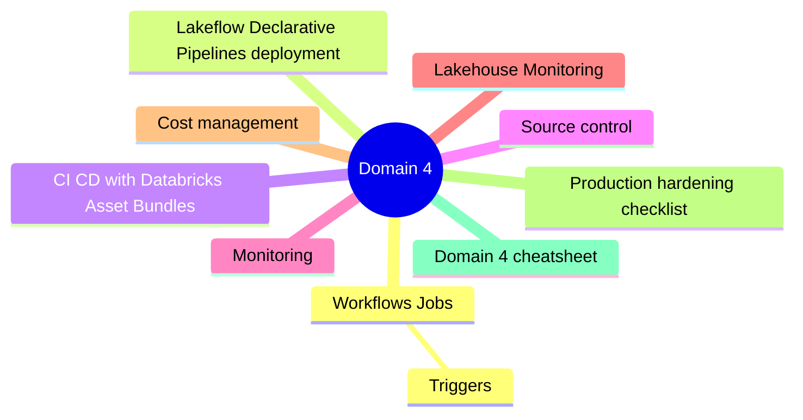
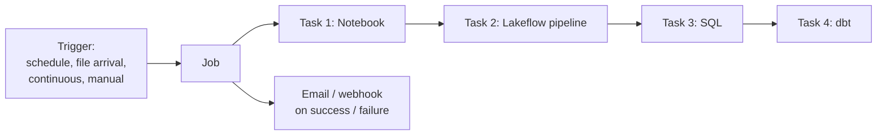
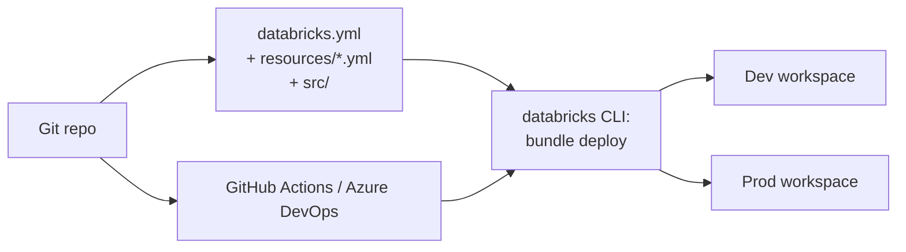
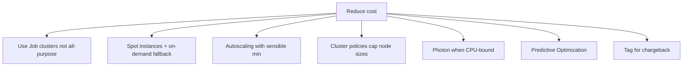

# Domain 4: Deploy and Maintain Data Pipelines and Workloads

> Workflows, Lakeflow Declarative Pipelines, CI/CD with Asset Bundles, monitoring.


## Domain mind map



## Workflows (Jobs)



| Task type | Notes |
|---|---|
| Notebook | Python / SQL / Scala / R |
| Python script | From repo / file |
| Python wheel | Packaged code |
| Spark JAR | Compiled JAR |
| SQL | Query, dashboard, alert, file |
| dbt | dbt project |
| **Lakeflow Declarative Pipeline** | Pipeline run as a task |
| If / else condition | Conditional branching |
| For each | Iterate over a list |

### Triggers

| Trigger | Behavior |
|---|---|
| **Manual** | Run on demand |
| **Schedule** | Cron-style |
| **File arrival** | New file in path triggers job |
| **Continuous** | Always running (with downtime backoff) |

## Lakeflow Declarative Pipelines deployment

| Mode | Behavior |
|---|---|
| **Triggered** | Run once + stop |
| **Continuous** | Always running |
| **Development mode** | Cluster persists between runs (faster iteration) |
| **Production mode** | Ephemeral cluster |

- **Target schema** must be Unity-Catalog-enabled.
- **Settings**: edition (Core/Pro/Advanced), Photon, channel (Current/Preview).

## CI/CD with Databricks Asset Bundles



- **Bundle = job + pipeline + notebook + cluster definitions** in YAML.
- Targets (envs) override variables: `databricks bundle deploy -t prod`.
- Use service principals for non-interactive deploys.

```yaml
bundle:
  name: orders_etl
targets:
  dev:
    workspace:
      host: https://adb-...
  prod:
    mode: production
    workspace:
      host: https://adb-prod-...
resources:
  jobs:
    orders_job:
      tasks:
        - task_key: ingest
          notebook_task:
            notebook_path: ./src/ingest.py
```

## Source control

- Databricks **Repos** integrates with Azure DevOps / GitHub / GitLab / Bitbucket.
- Branch + PR + merge workflow.
- Notebooks store as `.py` / `.sql` / `.ipynb` source files.

## Monitoring

| Tool | What |
|---|---|
| Workflows UI | Run history, durations, error logs |
| Cluster event log + driver/worker logs | Spark detail |
| **Lakeflow pipeline event log** | Per-update events as Delta table |
| **System tables** | `system.access.audit`, `system.billing.usage`, `system.compute.*` |
| Alerts | Email + webhook from jobs |
| Lakehouse Monitoring | Data quality + drift on tables |

## Lakehouse Monitoring

- Profile: `Snapshot`, `TimeSeries`, `InferenceLog`.
- Auto-generates dashboard + alerts.
- Powered by metrics tables in same UC schema.

## Cost management



## Production hardening checklist

- [ ] Dedicated service principal per environment.
- [ ] Secrets in Key Vault-backed scope.
- [ ] Source control + Asset Bundles.
- [ ] Cluster policies in place.
- [ ] System tables enabled for usage/audit/lineage.
- [ ] Lakeflow pipelines event log monitored.
- [ ] Predictive Optimization on hot tables.
- [ ] DR plan: workspace export + cross-region replication of Delta data.

## Domain 4 cheatsheet

| Wording | Answer |
|---|---|
| "kick off job when file lands" | File-arrival trigger |
| "iterate over list of regions" | For-each task |
| "package + deploy job + pipeline + notebooks" | Databricks Asset Bundles |
| "branching code per env" | Bundle target overrides |
| "table of every audit event" | `system.access.audit` |
| "auto-detect data drift on a Gold table" | Lakehouse Monitoring (TimeSeries / InferenceLog) |
| "interactive cluster reused for many notebooks" | All-purpose cluster |
| "ephemeral cluster per run" | Job cluster |

---

**Next:** open [05-exam-cheatsheet.md](05-exam-cheatsheet.md)
