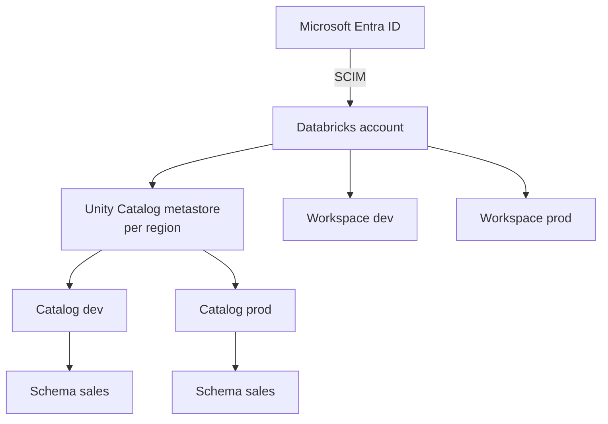
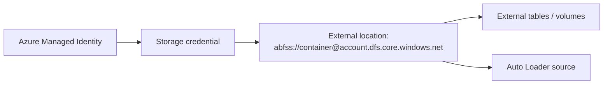
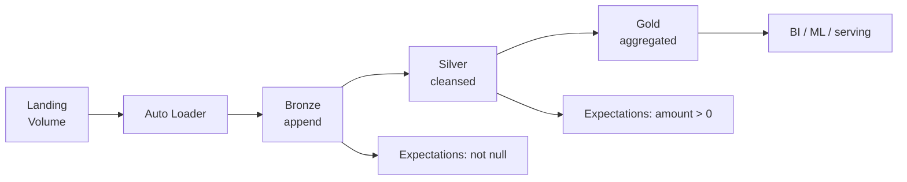
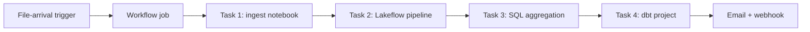
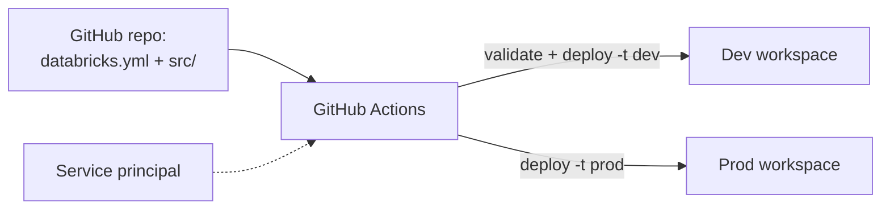
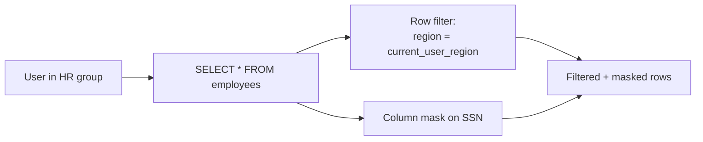
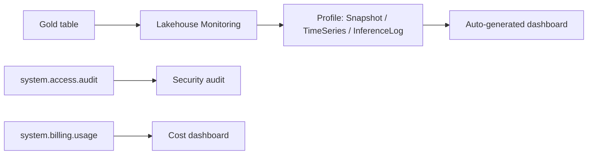
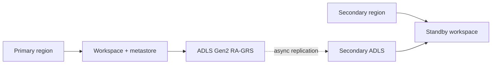

# DP-750 Architectures

## 1. Workspace + account topology

## 2. Storage credentials + external locations

## 3. Medallion + Lakeflow pipeline

## 4. Workflows orchestration

## 5. CI/CD with Asset Bundles

## 6. Row-level security pattern

## 7. Lakehouse Monitoring + system tables

## 8. Multi-region DR

---

[Master Index](00-MASTER-INDEX.md)
